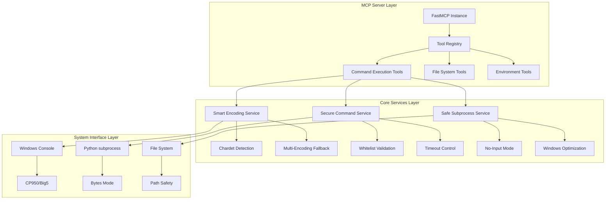

# MCP Command Execution Server

[](https://opensource.org/licenses/MIT)
[](https://www.python.org/downloads/)
[]()

**支援智能編碼處理的 Windows 命令執行 MCP 服務器**

這是一個專為 Windows 環境設計的 MCP (Model Control Protocol) 服務器，解決了 subprocess 卡住問題和中文編碼顯示異常等常見痛點。

## ✨ 主要特性

### 🔧 核心功能
- **智能編碼偵測**：自動偵測並處理 Windows 中文編碼（CP950、Big5、GBK 等）
- **防卡住機制**：徹底解決 subprocess 等待用戶輸入而卡住的問題
- **安全執行**：白名單命令機制，防止危險操作
- **超時控制**：可配置的命令執行超時，避免無限等待

### 🛡️ 安全特性
- **命令白名單**：只允許安全的預定義命令
- **目錄限制**：預設工作目錄保護
- **權限控制**：最小權限原則
- **錯誤處理**：完善的異常捕獲與回報

### 🌐 編碼支援
- **多編碼兼容**：CP950、Big5、CP936、GBK、UTF-8、UTF-16
- **智能偵測**：使用 chardet 進行編碼自動偵測
- **後備機制**：多重編碼嘗試策略
- **中文優化**：特別針對繁體/簡體中文環境優化

## 🚀 快速開始

### 環境需求
- Python 3.8+
- Windows 10/11
- Claude Desktop

### 安裝步驟

1. **克隆專案**
```bash
git clone https://github.com/pursky7468/mcp-command-execution-server.git
cd mcp-command-execution-server
```

2. **安裝依賴**
```bash
pip install -r requirements.txt
```

3. **測試服務器**
```bash
python server_fastmcp_fixed_v3_encoding.py
```

4. **配置 Claude Desktop**

編輯 Claude Desktop 配置檔：
```
%APPDATA%\Claude\claude_desktop_config.json
```

添加以下配置：
```json
{
  "mcpServers": {
    "command-execution-v3": {
      "command": "python",
      "args": ["C:\\path\\to\\your\\server_fastmcp_fixed_v3_encoding.py"],
      "env": {
        "PYTHONPATH": "C:\\path\\to\\your\\project",
        "PYTHONIOENCODING": "cp950"
      }
    }
  }
}
```

5. **重啟 Claude Desktop**

## 🔨 可用工具

### 1. execute_command
執行系統命令（支援智能編碼）
```python
# 範例
execute_command("dir", "C:\\Users", 30)
execute_command("git status")
```

### 2. list_directory_safe
安全的目錄列表（Python 實作，避免編碼問題）
```python
list_directory_safe("C:\\Users\\User\\Desktop")
```

### 3. run_python_script
執行 Python 腳本（智能編碼 + 防卡住）
```python
run_python_script("test.py", ["arg1", "arg2"])
```

### 4. check_python_environment
檢查 Python 環境資訊
```python
check_python_environment()
```

### 5. get_git_status
取得 Git 狀態（無互動模式）
```python
get_git_status()
```

### 6. install_requirements
安裝 requirements.txt 依賴
```python
install_requirements()
```

## 🏗️ 架構設計

### 技術架構圖



### 設計原則遵循

#### SOLID 原則
- **單一職責** (SRP)：每個函數專職處理特定任務
- **開放封閉** (OCP)：編碼偵測策略可擴展
- **里氏替換** (LSP)：編碼處理函數可互換
- **介面隔離** (ISP)：工具函數介面精簡
- **依賴反轉** (DIP)：依賴抽象而非具體實作

#### Clean Architecture 概念
- **外層**：MCP 工具接口
- **應用層**：命令執行邏輯
- **基礎設施層**：系統調用與編碼處理

## 🧪 使用範例

### 基本命令執行
```python
# 查看目錄內容
result = execute_command("dir C:\\Users")
print(result["data"]["stdout"])

# 檢查 Git 狀態
git_status = get_git_status()
if git_status["data"]["is_clean"]:
    print("Git 倉庫乾淨，無待提交更改")
```

### Python 環境管理
```python
# 檢查環境
env_info = check_python_environment()
print(f"Python 版本：{env_info['data']['python_version']}")

# 安裝依賴
install_result = install_requirements()
if install_result["status"] == "success":
    print("依賴安裝成功")
```

## 🔧 設定選項

### 全域設定
```python
# 預設工作目錄
WORKING_DIRECTORY = r"C:\Users\User\Desktop\LineBot"

# 允許的命令白名單
ALLOWED_COMMANDS = [
    "python", "pip", "git", "dir", "ls", "cd", 
    "mkdir", "copy", "move", "del", "type", "cat"
]
```

### 編碼設定
```python
# 編碼嘗試順序（可自訂）
encodings_to_try = [
    'cp950',      # Windows 繁體中文
    'big5',       # Big5 編碼
    'cp936',      # Windows 簡體中文
    'gbk',        # GBK 編碼
    'utf-8',      # UTF-8
    'utf-16',     # UTF-16
    'latin1',     # Latin-1 (fallback)
]
```

## 🐛 疑難排解

### 常見問題

#### 1. 中文亂碼問題
**症狀**：輸出出現 `�` 或亂碼字符
**解決**：
```bash
# 設定環境變數
set PYTHONIOENCODING=cp950
```

#### 2. 命令卡住不執行
**症狀**：命令執行後無回應
**解決**：本版本已修正，使用 `stdin=subprocess.DEVNULL`

#### 3. Git 命令互動模式
**症狀**：Git 命令需要用戶輸入
**解決**：自動添加 `--no-pager` 和 `-c color.status=false`

#### 4. 權限不足
**症狀**：無法執行某些命令
**解決**：檢查 Windows 用戶權限，或調整 `ALLOWED_COMMANDS`

### 除錯模式
```python
# 啟用詳細日誌
import logging
logging.basicConfig(level=logging.DEBUG)
```

## 🤝 貢獻指南

歡迎提交 Issue 和 Pull Request！

### 開發環境設置
```bash
git clone https://github.com/pursky7468/mcp-command-execution-server.git
cd mcp-command-execution-server
pip install -r requirements.txt
pip install -e ".[dev]"  # 開發依賴
```

### 程式碼風格
- 遵循 PEP 8
- 使用繁體中文註解
- 函數需要完整的 docstring

### 測試
```bash
python -m pytest tests/
```

## 📄 授權條款

本專案採用 MIT 授權條款 - 詳見 [LICENSE](LICENSE) 檔案

## 🙏 致謝

- [FastMCP](https://github.com/jlowin/fastmcp) - MCP 框架支援
- [chardet](https://github.com/chardet/chardet) - 編碼偵測
- Windows 中文開發社群的經驗分享

## 📞 聯絡資訊

如有問題或建議，歡迎：
- 提交 [GitHub Issue](https://github.com/pursky7468/mcp-command-execution-server/issues)
- 發送 Pull Request

---

**Made with ❤️ for Windows Chinese Developers**